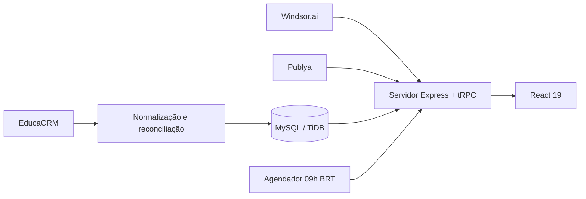

# Dashboard APSY

Dashboard executivo e operacional da APSY para acompanhar mídia, funil comercial, metas, pacing e otimizações em uma única aplicação auditável.

> **Estado da migração:** o EducaCRM é a fonte oficial de CRM desde o checkpoint de 21/09/2026. O Cirqua foi removido do fluxo produtivo. Meta Ads e Google Ads usam Windsor.ai nas contas oficiais da APSY; programática usa Publya e snapshots históricos.

## Visão geral

O projeto consolida quatro domínios de dados:

| Domínio | Fonte oficial | Uso principal |
|---|---|---|
| CRM | EducaCRM API | Leads, contatos, inscritos, matrículas, curso, origem e funil normalizado |
| Meta Ads | Windsor.ai, conta `1977935416423618` | Investimento, entrega, leads, conversas, campanhas, conjuntos e criativos |
| Google Ads | Windsor.ai, conta `933-247-0027` | Investimento, conversões, campanhas, palavras-chave, termos e dispositivos |
| Programática | Publya API e snapshots históricos | Campanhas, investimento, impressões, cliques e vídeo |

A interface oferece visão geral, módulos Meta, Google, Programática e Leads, gestão de metas e pacing, recomendações operacionais, auditoria e usuários com papéis de acesso.

## Arquitetura



O frontend React consome somente procedimentos tRPC. O servidor aplica autenticação, autorização, cache e agregações. O snapshot de CRM é substituído em uma transação: a tabela anterior só é removida se toda a nova carga puder ser inserida. A rotina diária usa **D-1 no fuso de Brasília**.

Detalhes: [Arquitetura](docs/ARCHITECTURE.md), [Runbook de migração](docs/MIGRATION_RUNBOOK.md), [Operação](docs/OPERATIONS.md) e [Dicionário de dados](docs/DATA_DICTIONARY.md).

## Stack

- React 19, TypeScript, Vite e Tailwind CSS 4
- Express 4 e tRPC 11
- Drizzle ORM e MySQL/TiDB
- Vitest
- Node.js 22 e pnpm 10

## Início rápido

### 1. Requisitos

- Node.js 22
- pnpm 10
- Banco compatível com MySQL
- Credenciais para EducaCRM, Windsor.ai e, quando aplicável, Publya

### 2. Configuração

Consulte [Variáveis de ambiente](docs/ENVIRONMENT.md) e configure os valores no cofre de secrets do ambiente. **Nunca grave tokens ou senhas no repositório.**

### 3. Instalação e banco

```bash
pnpm install --frozen-lockfile --ignore-scripts
pnpm db:migrate
```

### 4. Primeiro administrador

```bash
ADMIN_NAME="Administrador APSY" \
ADMIN_USERNAME="admin" \
ADMIN_PASSWORD="uma-senha-forte-e-unica" \
pnpm admin:create
```

### 5. Carga inicial

```bash
# Backup do snapshot de CRM existente, se houver
pnpm exec tsx scripts/backup_crm_before_educacrm.ts

# Carga integral do EducaCRM até a data atual em BRT
pnpm crm:sync

# Auditoria sem alterar o banco
pnpm crm:audit
```

O diretório `artifacts/` recebe backups e relatórios locais e é ignorado pelo Git.

### 6. Executar

```bash
pnpm dev
```

Para produção:

```bash
pnpm build
pnpm start
```

Uma imagem reproduzível está disponível no `Dockerfile`.

## Qualidade

```bash
pnpm validate          # TypeScript, testes determinísticos e build
pnpm test:integration  # Testes reais das APIs; exige secrets
```

O GitHub Actions executa `test:ci`, typecheck e build em pushes e pull requests para `main`.

## Regras de negócio essenciais

- **Lead considerado:** etapa reconhecida pela taxonomia oficial e diferente de `FORA_DA_BASE`.
- **Funil único:** Não Localizado, Em Atendimento, Qualificado, Fechamento e Matriculado; Recusa, Desqualificado e Encaminhado para Graduação ficam como saídas/direcionamentos. Consulte o [dicionário](docs/DATA_DICTIONARY.md).
- **Tempo:** persistência técnica em UTC quando aplicável; cortes, filtros e comunicação em `America/Sao_Paulo`.
- **Mídia:** apenas as contas oficiais documentadas são consultadas.
- **Programática:** ausência de entrega não é convertida em zero fictício nem misturada com Meta/Google.

## Segurança e dados pessoais

O repositório deve permanecer **privado**. Ele não contém credenciais, exportações de leads, backups de banco ou relatórios com dados pessoais. Consulte [SECURITY.md](SECURITY.md) antes de configurar um novo ambiente.

## Documentação

| Documento | Finalidade |
|---|---|
| [Arquitetura](docs/ARCHITECTURE.md) | Componentes, fluxos e decisões técnicas |
| [Runbook de migração](docs/MIGRATION_RUNBOOK.md) | Implantação, cutover, validação e rollback |
| [Operação](docs/OPERATIONS.md) | Rotinas diárias, incidentes e manutenção |
| [Dicionário de dados](docs/DATA_DICTIONARY.md) | Tabelas, etapas e critérios de normalização |
| [Padrão de funil CRM](docs/CRM_FUNNEL_STANDARD.md) | Definição única, tabulações, aliases e regras de contagem |
| [Variáveis de ambiente](docs/ENVIRONMENT.md) | Configuração sem exposição de secrets |
| [Validação da migração](docs/MIGRATION_VALIDATION.md) | Baseline auditada e critérios de aceite |
| [ADR EducaCRM](docs/adr/0001-educacrm-source-of-truth.md) | Decisão de substituir o Cirqua |

## Referências

[1]: https://crm.apsyedu.com.br/swagger/ "EducaCRM API — Swagger"
[2]: https://orm.drizzle.team/docs/migrations "Drizzle ORM — Migrations"
[3]: https://docs.github.com/en/actions "GitHub Actions documentation"
