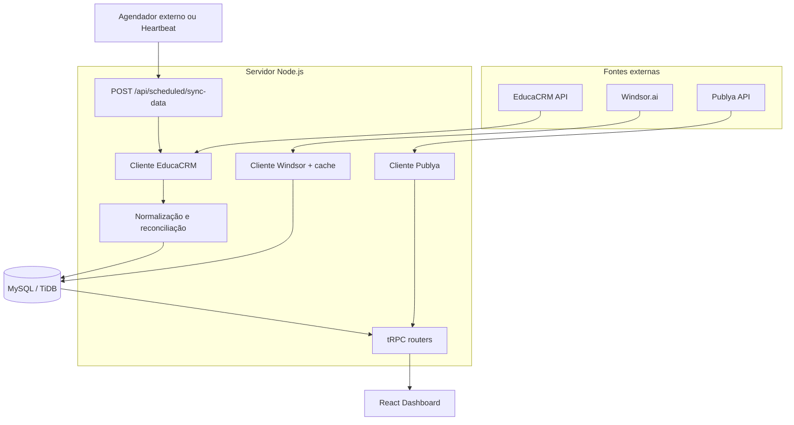

# Arquitetura do Dashboard APSY

## Objetivo

O Dashboard APSY concentra dados de mídia e CRM em uma aplicação única. A arquitetura separa aquisição de dados, normalização, persistência, regras de negócio e apresentação para que cada número possa ser rastreado até sua fonte.

## Componentes

### Frontend

O frontend fica em `client/src`. `App.tsx` registra as rotas Visão Geral, Meta, Google, Programática, Leads, Otimizações, Metas, Auditoria e Usuários. As telas não chamam fontes externas diretamente; todas usam o cliente tRPC.

### API e regras de negócio

`server/routers.ts` agrega os routers de autenticação local, mídia, CRM e otimizações. As regras de permissão são aplicadas no backend. A interface apenas reflete o acesso já decidido pelo servidor.

### Persistência

O schema Drizzle está em `drizzle/schema.ts`. A migração inicial versionada fica em `drizzle/0000_greedy_romulus.sql`. As tabelas principais são:

- `crm_leads`: snapshot normalizado do EducaCRM;
- `windsor_cache`: cache de respostas Meta e Google;
- `prog_dv360`, `prog_meta_social` e `prog_push`: snapshots de programática;
- `goals`: metas e orçamento;
- `optimizations`: diagnósticos e checklists;
- `audit_logs`: ações de usuários;
- `local_users`: autenticação local com hash `scrypt`.

## Fluxo do EducaCRM

`server/educacrm.ts` consulta cinco recursos paginados em paralelo controlado:

1. `captacao/leads/`;
2. `captacao/contatos/`;
3. `ingresso/inscritos/`;
4. `estrutura/cursos/`;
5. `captacao/situacoes/`.

A reconciliação usa e-mail normalizado, telefone apenas com dígitos e CPF apenas com dígitos. Quando existem várias correspondências, a seleção considera curso, data e estágio. Inscrições sem lead conciliável são preservadas como registros `educacrm-inscrito:<codigo>`.

O resultado é convertido para `NormalisedLead` e gravado em `crm_leads`. `replaceCrmLeads` executa exclusão e inserção dentro da mesma transação. Qualquer erro causa rollback e mantém o snapshot anterior.

## Fluxo de mídia

`server/windsor.ts` limita as consultas às contas oficiais:

| Plataforma | Conector | Conta |
|---|---|---|
| Meta Ads | `facebook` | `1977935416423618` |
| Google Ads | `google_ads` | `933-247-0027` |

O cache Windsor tem TTL de uma hora e pode devolver o último resultado válido quando a API falha. A regra Meta evita dupla contagem entre `actions_lead` e leads de pixel. Conversas de WhatsApp ficam em métrica separada.

A Publya usa token Bearer e o cabeçalho `User-Data`. A interface deve tratar linha sem entrega como ausência de dado, e não como entrega confirmada.

## Autenticação e autorização

A aplicação usa usuários locais. As senhas são armazenadas com `scrypt` e sal aleatório. A sessão JWT fica em cookie `HttpOnly`. Os papéis são `admin`, `analista` e `cliente`.

`JWT_SECRET` é obrigatório em produção. O primeiro administrador deve ser criado pelo comando `pnpm admin:create`; não existe credencial padrão no código.

## Atualização agendada

`POST /api/scheduled/sync-data` aceita duas formas de autorização:

- sessão de Heartbeat reconhecida pelo runtime Manus;
- `Authorization: Bearer <SCHEDULED_SYNC_SECRET>` em outro provedor.

A rotina calcula D-1 em Brasília, baixa o snapshot integral do EducaCRM, aplica uma barreira mínima de volume e substitui a tabela em transação. Em seguida, aquece a integração Publya.

## Decisões de confiabilidade

- Snapshot integral do CRM para capturar mudanças retroativas de etapa.
- Persistência transacional para evitar tabela parcial.
- Barreira mínima de 100 leads brutos e normalizados.
- Cache e fallback no Windsor.
- Backups e artefatos fora do Git.
- Testes determinísticos separados dos testes de integração reais.
- CI obrigatório para typecheck, testes e build.

## Limitações conhecidas

A API atual do EducaCRM não oferece MQL, SAL e SQL prontos. Essas etapas são uma normalização documentada. A cobertura de UTM observada na migração inicial foi baixa e deve ser acompanhada. O total de matrículas deve seguir o endpoint de inscritos do EducaCRM, não a fotografia histórica do Cirqua.

## Referências

[1]: https://crm.apsyedu.com.br/swagger/ "EducaCRM API — Swagger"
[2]: https://orm.drizzle.team/docs/migrations "Drizzle ORM — Migrations"
